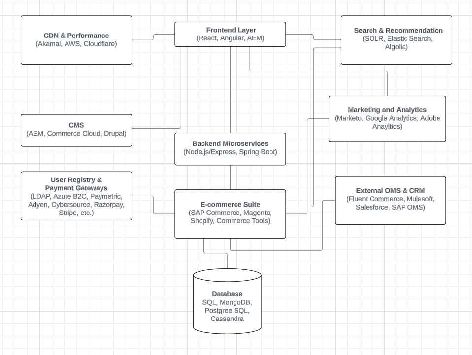

# Elevating-E-commerce-Unveiling-the-Architecture-Behind-Seamless-Shopping
This architecture sets the stage for unparalleled digital commerce experiences, empowering businesses to thrive in today's competitive landscape.

---

**Title: Elevating E-commerce: Unveiling the Architecture Behind Seamless Shopping**

🛒 **Backend Microservices:**
- **API Technologies:** Depending on traffic, we harness the agility of Node.js with Express for lighter loads, while Spring Boot powers our scaling needs.

🚀 **E-commerce Suite (Choose from):**
- **SAP Commerce Cloud:** Quick start with pre-built modules for smooth store setup and advanced promotion engines.
- **Magento:** Robust features for streamlined product management and order handling.
- **Commerce Tools:** Simplified inventory management and cart functionalities.
- **Shopify:** Ease of use for setting up and managing an online store effortlessly.

🔄 **External Order Management:**
- **Fluent Commerce, Mulesoft, SAP OMS:** Streamline order processing and fulfillment with API integrations for seamless information flow.

💬 **CRM Integration (Salesforce):**
- Enhance customer interactions, service delivery, and retention through comprehensive tracking and support features.

📝 **CMS Solutions (Select from):**
- **Adobe Experience Manager:** Tailored content design and publishing for engaging user experiences.
- **Commerce Cloud:** Simplified content management and delivery.
- **Drupal:** Flexible CMS for versatile content strategies.

🔐 **User Registry & Payments:**
- **LDAP, Azure B2C:** Efficient handling of user sign-ups, profile edits, and secure transactions.
- **Payment Gateways (Paymetric, Stripe, Paypal, etc.):** Seamless integration for secure and reliable payment processing.

🖥️ **Frontend Brilliance:**
- **ReactJS, Angular, AEM:** Craft visually appealing and responsive interfaces for web and mobile users.

🔍 **Search & Recommendation System:**
- **SOLR, Elastic Search, Algolia:** Deliver precise search results and personalized recommendations for enhanced user engagement.

🌐 **CDN & Performance Monitoring:**
- **Akamai, AWS, Cloudflare:** Optimize content delivery for faster page loads and implement robust monitoring tools for seamless performance tracking.

🔧 **System Tools for Excellence:**
- Implement system performance monitoring tools for real-time insights and proactive management.
- Enable logging support for seamless traceability and debugging.

📊 Marketing & Analytics Tools:

Marketo: Streamlines marketing automation and campaign management.
Google Analytics: Offers deep insights into user behavior and website performance.
Adobe Analytics: Provides advanced analytics and reporting for data-driven decisions.
🗄️ Database Layer:

SQL: Standard database language for data manipulation and retrieval.
PostgreSQL: Open-source database for scalability and reliability.
Cassandra: Distributed NoSQL database for high availability and fault tolerance.
This dynamic architecture fuels our e-commerce platform, delivering unparalleled user experiences, robust performance, and scalability.

---

**Diagram:**

